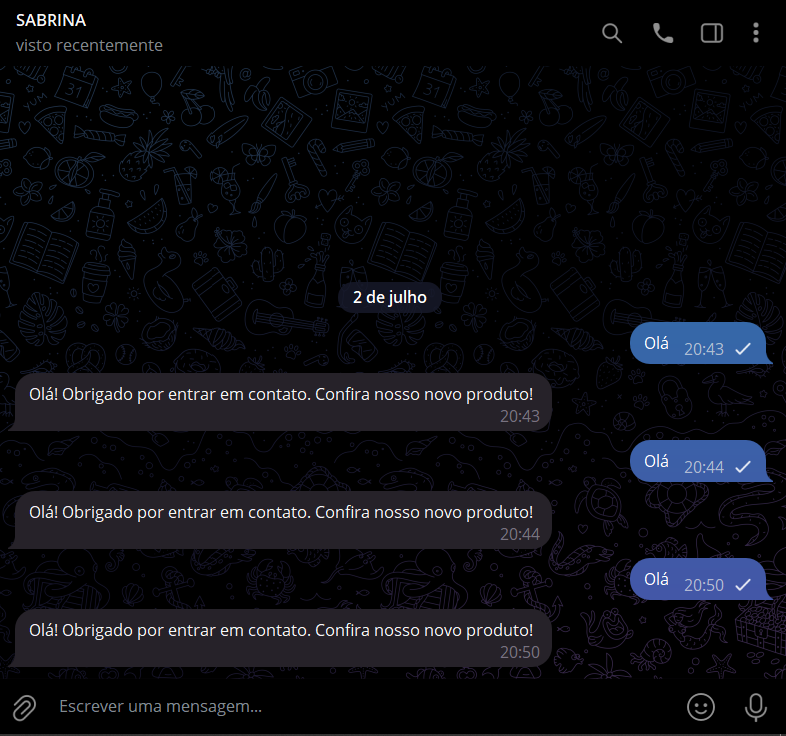

# SAUDACAO COM PYROGRAM
🤤ESSE É UM BOT DO TELEGRAM FEITO COM PYROGRAM QUE ENVIA UMA SAUDAÇÃO NO PRIVADO!

 <br>

## DESCRIÇÃO:
Este bot é ideal para empresas e desenvolvedores que desejam automatizar respostas de saudação e fornecer informações iniciais aos usuários que entram em contato via Telegram.

Este bot foi criado utilizando a biblioteca Pyrogram para Telegram. Ele possui as seguintes funcionalidades:

1. **Receber Mensagens Privadas**:
   - O bot está configurado para monitorar e responder a todas as mensagens recebidas em chats privados.

2. **Responder com uma Mensagem de Saudação**:
   - Sempre que o bot recebe uma mensagem em um chat privado, ele responde com uma mensagem de saudação personalizada.

## EXECUTANDO O PROJETO:
1. **Autorização do usuário:**
   - Para usar a API, o Telegram requer que os usuários sejam autorizados por meio de seus números de telefone.
   - Para fazer isso, siga as instruções do Telegram em [https://core.telegram.org/api/obtaining_api_id](https://core.telegram.org/api/obtaining_api_id) e certifique-se de entender e cumprir as regras para clientes e bibliotecas de terceiros explicadas lá. A chave da API consiste em duas partes: `api_id` e `api_hash`. Mantenha-a secreta. [...]
   - Após autorizar-se com sucesso, um novo arquivo chamado `my_account.session` será criado permitindo que o Pyrogram execute chamadas de API com sua identidade. Este arquivo é pessoal e será carregado novamente quando você reiniciar seu aplicativo.
   - Se você não sabe como fazer isso, [Clique aqui para ler a documentação](https://docs.pyrogram.org/start/auth).

2. **Instalando as dependências:**
   - Antes de executar o bot, certifique-se de instalar todas as dependências necessárias. No terminal, execute o seguinte comando para instalar as dependências listadas no arquivo `requirements.txt` em `CODIGO`:
   ```bash
   pip install -r requirements.txt
   ```

3. **Inicie o Bot:**
   - Execute o bot do Telegram iniciando-o com o seguinte comando:
    ```bash
    python CODIGO.py
    ```

4. **Interação com o Bot**:
   - Envie uma mensagem privada para o bot no Telegram. O bot responderá automaticamente com a mensagem de saudação configurada.

## NÃO SABE?
- Entendemos que para manipular arquivos em muitas linguagens e tecnologias relacionadas, é necessário possuir conhecimento nessas áreas. Para auxiliar nesse aprendizado, oferecemos cursos gratuitos disponíveis:
* [CURSO DE PYROGRAM](https://github.com/VILHALVA/CURSO-DE-PYROGRAM)
* [CURSO DE PYTHON](https://github.com/VILHALVA/CURSO-DE-PYTHON)
* [CONFIRA MAIS CURSOS](https://github.com/VILHALVA?tab=repositories&q=+topic:CURSO)

## CREDITOS:
- [PROJETO CRIADO PELO VILHALVA](https://github.com/VILHALVA)

